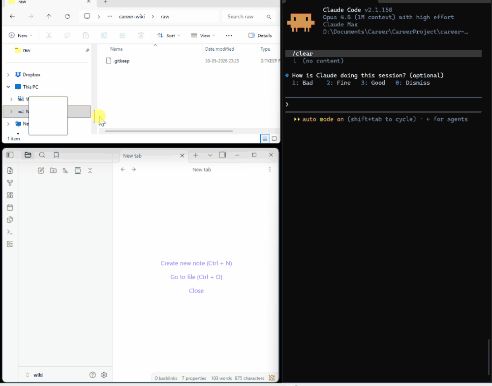

# Career Wiki

An LLM-maintained knowledge base about your professional life — resumes, projects, skills, achievements, stories, applications, and the people you've worked with — kept in plain Markdown and curated by Claude Code.

> Inspired by [Andrej Karpathy's LLM Wiki idea](https://x.com/karpathy/status/1884252385253169969) — the notion that an LLM can act as a long-running personal librarian, ingesting raw artifacts over time and maintaining a clean, queryable, hand-editable knowledge base on your behalf.

## Demo

## Why I built this

13 years as an engineer, and my own work was always scattered — old resumes, half-remembered projects, accomplishments I could never recall in interviews. I learn by building, not collecting credentials, so I built the tool I needed: drop in raw material, get back a clean, cross-linked career wiki that writes tailored CVs and interview stories on demand. Inspired by Karpathy's LLM Wiki idea. All hand-editable Markdown.

## What it's for

In priority order:

1. **Tailor CVs and cover letters** for specific job postings.
2. **Interview prep** — recall projects, metrics, and STAR stories on demand.
3. **Track career progression** — roles, skills, achievements over time.
4. **Portfolio / LinkedIn content.**
5. **Self-reflection and planning** — spot gaps, plan next moves.

## Getting started

1. Open this directory in [Claude Code](https://claude.com/claude-code).
2. Drop a few documents into `raw/` — old resumes, project notes, anything career-relevant.
3. Start a session. Claude will greet you with the A / B / C menu.
4. Pick **A** and ask the maintainer to ingest what you just dropped in.
5. From then on, ask questions, tailor applications, or generate profiles whenever you need them.

The wiki gets richer the more you feed it. Treat `raw/` as your inbox.

## Tailor for a job

Found a role you want? Just paste the job description into a session and ask. The maintainer will:

1. **Tailor your CV** — rewrite and reorder your experience to match what the JD actually asks for, drawing only on what's in your wiki.
2. **Surface the gaps** — flag the requirements you don't yet evidence, so you know where you're stretching before they do.
3. **Hand off to a prep plan** — point you to the Profile Builder (menu **B**) to generate interview stories and a study/revision plan targeted at that same role.

> **You:** "Here's the JD: \<paste\>. Tailor my CV for it and tell me where I fall short."

Everything it produces lands in `output/` as a draft for you to review and edit.

## The two agents

This project ships with two specialized subagents under `.claude/agents/`. The root `CLAUDE.md` acts as a router that dispatches to the right one.

- **`career-wiki-maintainer`** — owns `wiki/`. Ingests new sources from `raw/`, answers questions about your career, tailors CVs and cover letters for a job description, runs lint passes for staleness and contradictions, and proposes schema edits.
- **`profile-builder`** — read-only on `wiki/` and `raw/`. Runs an interactive interview about a target role and produces a creative HTML profile, an HTML revision/study plan (both with "Save as PDF"), and a tailored interview-prep Markdown. All outputs go under `output/profiles/`.

At session start, Claude greets you with an **A / B / C** menu so you can pick which agent to invoke (or handle a one-off schema edit inline). See `CLAUDE.md` for the directory layout and full page schema — the canonical source where conventions evolve.

## How it works

You drop source documents (resumes, performance reviews, project write-ups, recommendation letters, transcripts, screenshots, etc.) into `raw/`. Claude Code ingests them on request, normalizes the contents into a wiki of cross-linked Markdown pages under `wiki/`, and keeps an append-only `log.md` of everything it has done.

`raw/` is **read-only** to the agents — your originals are never edited, moved, or deleted. The wiki is fully hand-editable; if you don't like how something was summarized, just edit the file.

Your own `wiki/` and `log.md` are git-ignored so your real career data stays private. To see the shape of a populated wiki first, browse [`example-wiki/`](example-wiki/) and [`example-log.md`](example-log.md) — a complete sample built from the fictional "Maya Sharma" persona.

## Privacy

Your data stays local, and the agents never write sensitive fields — salary, home address, government IDs, credentials, or others' private contacts — into any generated file. Your own contact details live only in `wiki/profile.md`, and NDA-covered sources are paraphrased rather than quoted.

See `CLAUDE.md` for the full privacy rules.

---

> Generated from [career-wiki](https://github.com/harpalnain/career-wiki) — an LLM-maintained career wiki template.
